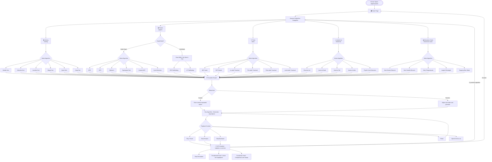

# DSA Visualizer

A production-quality, interactive **Data Structures & Algorithms Visualizer** built with React 18 + TypeScript + Vite + Tailwind CSS.

## 🗺️ Site Flow



## Features

### 5 Algorithm Categories

| Category | Algorithms |
|---|---|
| **Sorting** | Bubble, Selection, Insertion, Merge, Quick, Heap Sort |
| **Graphs** | BFS, DFS, Dijkstra's, A*, Topological Sort, Kruskal's MST, Cycle Detection |
| **Trees** | BST Insert, BST Search, In-order, Pre-order, Post-order, Level-order |
| **Linked List** | Reverse, Insert (head/tail/index), Floyd's Cycle Detection |
| **Monotonic Stack** | Next Greater/Smaller Element, Daily Temperatures, Largest Rectangle in Histogram, Trapping Rain Water |

### Global Features (every visualizer)
- **Step-by-step playback** — Play, Pause, Step Forward/Back, Reset
- **Speed control** — 0.25x to 4x playback speed
- **Custom input** — Enter comma-separated values for any algorithm
- **Random generation** — Size slider (5–100 elements for sorting)
- **Pseudocode sync** — Active line highlighted in sync with the current step
- **Complexity panel** — Best/Avg/Worst/Space with live comparison/swap counts
- **Keyboard shortcuts** — Space (play/pause), ← → (step), R (reset)
- **Light/dark mode** — Persisted in localStorage

### Graph Visualizer Extras
- Interactive SVG canvas — drag nodes, Shift+click to add edges
- Toggle directed/undirected and weighted/unweighted
- **Grid mode** — paint walls, set start/end for BFS and A* pathfinding

## Getting Started

```bash
npm install
npm run dev
```

Open [http://localhost:5173](http://localhost:5173).

## Project Structure

```
src/
  algorithms/
    sorting/          bubbleSort, selectionSort, insertionSort, mergeSort, quickSort, heapSort
    graphs/           graphAlgorithms, gridAlgorithms
    trees/            treeAlgorithms
    linkedList/       linkedListAlgorithms
    monotonicStack/   stackAlgorithms
  components/
    layout/           Sidebar, Navbar, ControlPanel
    shared/           CodePanel, StepDescription, ComplexityPanel, CustomInputModal
  hooks/              usePlayback, useKeyboardShortcuts, useTheme
  pages/              SortingPage, GraphPage, TreePage, LinkedListPage, MonotonicStackPage, HomePage
  types/              step.ts (all shared TypeScript types)
```

## Architecture: Step-Object Pattern

Every algorithm returns an array of **step objects** instead of running imperatively:

```ts
interface SortStep {
  type: 'compare' | 'swap' | 'mark-sorted' | ...;
  array: number[];          // snapshot of array state
  highlights: Highlight[];  // which indices are highlighted and in what state
  comparisons: number;
  swaps: number;
  description: string;      // plain English explanation of this step
  pseudocodeLine: number;   // which pseudocode line is active
}
```

This cleanly decouples algorithm logic from animation timing. Playback speed, step forward/backward, and scrubbing all work without touching algorithm code.

## Adding a New Algorithm

1. **Create the generator** in `src/algorithms/<category>/myAlgo.ts`:
   ```ts
   export function myAlgo(input: number[]): SortStep[] {
     const steps: SortStep[] = [];
     // ... compute steps
     return steps;
   }
   export const myAlgoPseudocode = ['line 1', 'line 2', ...];
   export const myAlgoComplexity = { best: 'O(n)', average: 'O(n log n)', worst: 'O(n²)', space: 'O(1)' };
   ```

2. **Register it** in the relevant index file (e.g., `src/algorithms/sorting/index.ts`):
   ```ts
   SORTING_ALGORITHMS.push({ id: 'myalgo', name: 'My Algo', fn: myAlgo, pseudocode: myAlgoPseudocode, complexity: myAlgoComplexity });
   ```

3. **Add a tab** in the corresponding page component. The visualizer reuses the same `ControlPanel`, `CodePanel`, and `StepDescription` components automatically.

## Tech Stack

- **React 18** + **TypeScript** (strict mode)
- **Vite** with `@tailwindcss/vite` plugin
- **Tailwind CSS v4** for utility styling
- **React Router** for category-based routing
- **SVG** for all visualizations (sorting bars, graph canvas, tree layout, linked list)

## Color State Palette

| State | Color | Usage |
|---|---|---|
| Default | Slate-700 | Unvisited/idle elements |
| Comparing | Amber-400 | Elements being compared |
| Active/Swap | Blue-400 | Elements being swapped or actively processed |
| Sorted/Visited | Emerald-500 | Finalized/visited elements |
| Pivot | Violet-500 | Pivot selection in Quick Sort |
| Accent | Indigo-500 | Active nodes, start node, pointers |
